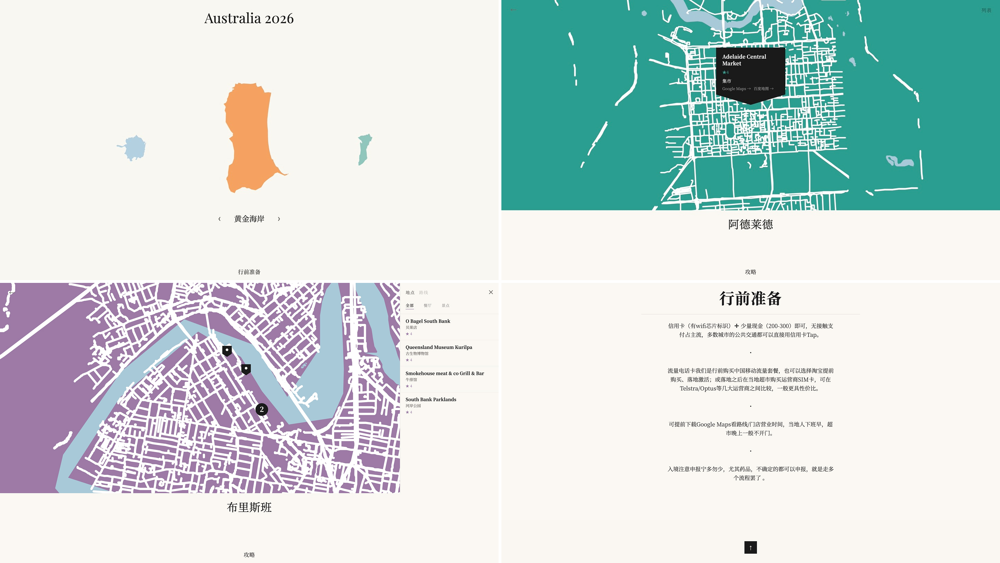

# TripSharer

🇨🇳 [中文版](README.md)

Back from a trip and everyone wants your recommendations? Log your spots and notes in Notion — TripSharer generates a beautiful map site you can share with anyone, instantly.



[Live Demo →](https://au2026.cathylau.com/index.html)

## Features

- **Stylized city maps**: Hand-drawn style SVG maps with every place you visited
- **City guides**: Notes and tips pulled directly from your Notion pages
- **Places & routes**: Tap any pin to see ratings, notes, and navigation links
- **One link to share**: Opens in any browser, no login required

## Agent Compatibility

| Platform | Status | Notes |
|----------|--------|-------|
| Claude Code | Supported | `/tripsharer-setup` guided skill in development |
| Local Agent (shell + internet access) | Supported | Follow this README |
| Regular Chatbot | Not recommended | Cannot run npm commands or handle deployment |

## Setup

You need to do three things yourself — hand the rest to your Agent:

**1. Create a Notion Integration**

Go to [notion.so/my-integrations](https://www.notion.so/my-integrations), create a new Integration, and copy the Token.

**2. Duplicate the Notion template, fill in your content, and connect your Integration via Connections in each page**

[Open Notion Template](https://www.notion.so/cccathylau/TripSharer-Template-17a0c7ad070a82de8cbb01e252863fee)

Once done, note the IDs of these pages (open the page → copy link → the 32-character string at the end): Places database, Overview page, and each city's Notes page.

**3. Get an API Key and choose your deployment**

**Geocoding** (converts addresses to coordinates)
- International cities → [Google Maps API Key](https://console.cloud.google.com/) (recommended)
- Mainland China cities → [Gaode API Key](https://lbs.amap.com/) (required)

**Deployment**
- GitHub Pages → free, zero extra setup, works globally
- Tencent Cloud COS → better access from mainland China (see the Deployment section below)

## Hand Off to Agent

Fork this repo, then tell your Agent:

> "Help me configure and deploy TripSharer following the README. My Notion Token is xxx and my page IDs are xxx."

Your Agent will read this document and handle the rest.

<details>
<summary>Manual setup steps</summary>

1. Fork and clone the repo, run `npm install && cp .env.example .env`, fill in your Token and API Key
2. Edit `trips.config.js` with your Notion page IDs and city info
3. `npm run fetch my-trip` (first run takes ~5–10 minutes)
4. `git add data/ && git commit -m "chore: add notion data"`
5. `npm run build my-trip` (local preview)
6. Follow the Deployment section below to publish

</details>

## Updating Content

**Updated Notion content** (added places, edited notes)
Run `npm run fetch my-trip` locally, then `git add data/ && git commit && git push` — CI builds and deploys automatically. Or trigger the Fetch Notion Data workflow manually in GitHub Actions (it commits the data for you).

**Updated code**
Push to main — GitHub Actions rebuilds and redeploys.

<br>

## Technical Reference

### Environment Variables

| Variable | Purpose | Required |
|----------|---------|----------|
| `NOTION_TOKEN` | Notion Integration Token | Yes |
| `GOOGLE_MAPS_KEY` | Google geocoding, better accuracy for international cities | Recommended |
| `GAODE_KEY` | Gaode API Key for mainland China cities | Required for China cities |
| `TENCENT_SECRET_ID` | Tencent Cloud COS credentials | COS deployment only |
| `TENCENT_SECRET_KEY` | Tencent Cloud COS credentials | COS deployment only |

### trips.config.js

```js
"my-trip": {
  databaseId: "",          // Notion Places database ID
  overviewPageId: "",      // Overview page ID
  cityPageIds: {           // city key → city Notes page ID
    city1: "",
  },
  citySearchTerms: {       // city key → search term for map boundary
    city1: "City Name, Country",
  },
  cityColors: {            // optional; auto-assigned from palette if omitted
    city1: "#E85D4A",
  },
  cityUrbanBBox: {         // optional; bbox [south, west, north, east] for road data
    city1: [lat_s, lng_w, lat_n, lng_e],
  },
  cityZhNames: {           // Chinese city names for Baidu Maps navigation links
    city1: "City Name",
  },
  region: "international", // "international" or "domestic" (mainland China, uses Gaode)
  theme: { primary: "#E85D4A" },
  siteUrl: "https://your-username.github.io/TripSharer-Template",
}
```

**How to get a Notion ID**: Open the page or database, copy the URL. The ID is the 32-character string before `?v=` (remove hyphens).

### Notion Database Schema

**Places Database**

| Field | Type | Description |
|-------|------|-------------|
| Name | Title | Place name |
| City | Select | City key — must match the key in `trips.config.js` |
| Category | Select | Type (attraction / restaurant / shopping, etc.) |
| Address | Rich Text | Address; auto-geocoded if left blank |
| Lat | Number | Latitude; auto-fetched if blank |
| Lng | Number | Longitude; auto-fetched if blank |
| Rating | Number | Rating 0–5 |
| Description | Rich Text | Full description, shown in map popup |
| Short Note | Rich Text | One-line summary, shown below the rating |
| Day | Number | Day number (1/2/3…), used for route grouping |
| Route Order | Number | Order within the day |

**Overview Page and City Notes Pages**

- **Overview Page**: Pre-trip info (SIM card, currency, packing list, etc.). Supports paragraphs, H1 headings, ordered/unordered lists.
- **City Notes Pages**: One page per city for transport tips, local advice, etc. The page title becomes the city display name.
- **City theme color**: Add a Callout block anywhere on the page with a 🎨 emoji, and write a hex value (`#E85D4A`) or color name (`coral`). It's picked up automatically during fetch.

### Deployment

**GitHub Pages (default)**

1. Repo Settings → Pages → Source: select **GitHub Actions**
2. Settings → Secrets → Actions: add `NOTION_TOKEN` (and `GOOGLE_MAPS_KEY` or `GAODE_KEY`)
3. Edit `.github/workflows/deploy-gh-pages.yml` — replace `my-trip` with your trip ID
4. Push → auto-build and deploy. URL format: `https://[username].github.io/[repo-name]`

**Tencent Cloud COS (better for mainland China access)**

COS Hong Kong node connects directly from mainland China — no ICP filing required. See [`docs/cos-setup.md`](docs/cos-setup.md) for setup, then run:

```bash
npm run deploy my-trip
```

### FAQ

**Geocoding fails**
Check that the Address field is filled in Notion. For mainland China cities, make sure `GAODE_KEY` is set.

**Fetch is slow**
The first run downloads road network and water body data for each city — expect 5–10 minutes. Subsequent runs resume from cache.

**GitHub Actions fails**
Confirm that Secrets are added and that Pages Source is set to GitHub Actions.

**COS CORS error**
The COS bucket needs CORS configured. See `docs/cos-setup.md`.
